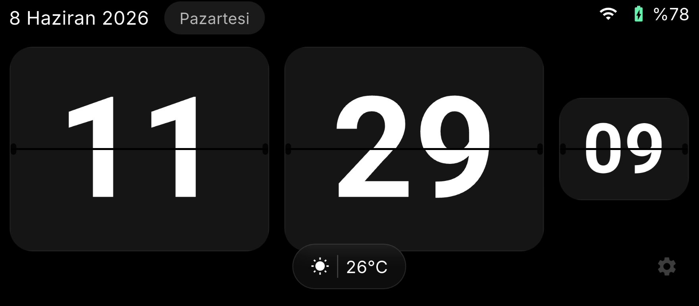

# TagClock 🕰️

TagClock is a minimalist, premium mobile clock application optimized exclusively for landscape orientation. It is inspired by the clean design aesthetics of Apple, Tesla, and Nothing.

The application features a large, beautifully rendered **Flip Clock** with a realistic 3D mechanical flip effect, a dark glassmorphic UI, fluid 60 FPS animations, and system status integration.

---

## ✨ Features

- **3D Flip Clock Animation:** A high-performance mechanical flip animation built using 3D `Matrix4` transformations to rotate cards smoothly from top to bottom.
- **Live Weather Integration:** Auto-detects location via IP address using WeatherAPI.com to display real-time temperature and weather conditions at the bottom.
- **System Status Bar:** Displays connection status and battery diagnostics:
  - Real-time Wi-Fi connectivity indicator.
  - Live battery percentage and charging state animation.
- **Glassmorphism Design:** Dark gray/black glassmorphic panels with a subtle outer border, soft shadows, and deep background blur (`BackdropFilter`).
- **Sticky Immersive Mode:** Completely hides system navigation and status bars so you can focus entirely on the clock.
- **Custom App Icon:** Designed and configured for both Android and iOS platforms.

---

## ⚙️ Interactive Settings

Access the settings panel by **long-pressing the system status icons** (top right) or tapping the **hidden settings icon** (bottom right):
- Toggle 12-hour / 24-hour time format.
- Show or hide seconds.
- Show or hide the date and weekday.
- Show or hide the weather card.
- Toggle full-screen (immersive) mode.

---

## 📲 How to Install (Android)

1. Go to the [Releases](https://github.com) section of this repository.
2. Download the latest `app-release.apk` file.
3. Open the downloaded file on your Android device and install it (allow installation from unknown sources if prompted).

---

## 🔒 Publishing Note (For Developers)

If you wish to share this application on GitHub without sharing the underlying Flutter source code:
1. Create a new public repository on GitHub.
2. Initialize it with only this `README.md` and the `screenshot.png` file.
3. Go to **Releases** -> **Draft a new release**.
4. Upload the built `app-release.apk` (found in `build/app/outputs/flutter-apk/app-release.apk` after running `flutter build apk --release`) as a release asset.
5. Publish the release and link to it in this README.
